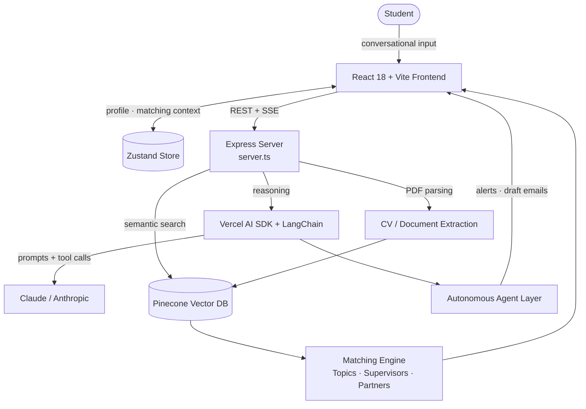

# Thesis Compass

> **From *"I'm starting my thesis"* to *"I'm handing it in"* — one intelligent, adaptive companion that anticipates what you need before you ask.**

Thesis Compass is an AI-first companion that guides university students through every stage of their thesis — from picking a topic to handing it in. Built at **ETH START Hack 2026** as the next layer on top of [Studyond](https://studyond.com)'s topic-discovery platform.


---

## The Problem

A thesis is a **24-week project** — but most platforms only help with the first four. Once a student picks a topic, they're alone for the remaining 4–6 months of planning, networking, execution, and finalization. **80% of thesis friction lives in those later stages.**

- **50 million** students write a thesis annually, worldwide.
- **3,300+** students are already on Studyond — but coverage drops off after topic discovery.
- **99.7%** of European companies have no central system for academic collaboration.
- Today's reality is a patchwork: Googling supervisors, cold-emailing professors, asking friends, scribbling deadlines into Notion. The emotional arc moves from *anxiety* ("did I pick the wrong topic?") through *isolation* ("am I on track?") to *panic* ("deadline is in three weeks").

There's no single layer that ties orientation, matching, planning, execution, and finalization together. Thesis Compass is that layer.

---

## The Vision

Just as GitHub became the default for development workflows and LinkedIn for professional identity, Thesis Compass positions Studyond as the **central hub for the entire thesis lifecycle.**

Four principles drive every decision:

1. **Anticipate, don't wait.** The system surfaces what you need next before you ask.
2. **Meet students where they are.** Modular entry, not a linear wizard — every student starts at a different stage.
3. **Get smarter over time.** Every interaction enriches a persistent `ThesisContext` profile.
4. **Suggest, never decide.** *AI suggests and supports; the professor approves, guides, and grades.*

> **Important constraint.** Thesis Compass is **organizational only**. It helps students plan, match, network, and organize — it does **not** write the thesis. Content generation stays out of scope by design, in service of academic integrity.

---

## How It Works — Five Subsystems

| # | Subsystem | What it does |
|---|-----------|--------------|
| 1 | **Thesis Companion** | End-to-end proactive guide across the 5 thesis stages (Orientation → Topic & Supervisor Search → Planning → Execution → Finalization). |
| 2 | **Context-Aware Matching** | Multi-factor ranking over topics, supervisors, and corporate partners, anchored on CV-extracted skills and conversational signals. |
| 3 | **Continuous Discovery** | Background agent that alerts students when newly listed topics, supervisors, or partners match their evolving profile. |
| 4 | **Proactive Networking** | Stage-aware suggestions for interview partners, mentors, and industry experts — and drafts the intro email. |
| 5 | **AI-First Interface** | Conversational UI replacing traditional forms. Onboarding is a chat, stage detection is a chat, refinement is a chat. |

### The 5 Stages

| Stage | Weeks | What Compass does |
|-------|-------|-------------------|
| Orientation | 1–4 | Field exploration, interest mapping, topic browsing |
| Topic & Supervisor Search | 2–8 | Activates matching agents, supervisor recommendations |
| Planning | 4–10 | Generates timeline, methodology suggestions, gap analysis |
| Execution | 6–20 | Progress tracking, interview-partner matching, nudges |
| Finalization | 16–24 | Deadline tracking, feedback-cycle management, submission checklist |

---

## Architecture



GitHub renders the diagram natively — no image asset, no broken links.

---

## Tech Stack

**Frontend** — React 18, Vite, React Router DOM, Zustand (central profile + matching context), Tailwind CSS, Framer Motion, Radix UI, shadcn/ui.

**Backend & AI** — Express (`server.ts`), Vercel AI SDK and LangChain orchestrating Claude / Anthropic models, server-side PDF parsing for CV extraction, and an autonomous agent layer for proactive alerts and draft communications.

**Matching** — Pinecone vector database powering semantic alignment between student skills and the topic / supervisor / company-partner corpus, producing an explainable match score.

**Execution workspace** — a stateful dashboard managing thesis milestones from proposal through final hand-in.

---

## Getting Started

The application lives in the [`thesis-compass/`](./thesis-compass) directory.

```bash
cd thesis-compass
# follow thesis-compass/SETUP.md for environment variables and run instructions
```

See [`thesis-compass/SETUP.md`](./thesis-compass/SETUP.md) for the full setup walkthrough and [`PRD.md`](./PRD.md) for the complete product specification.

---

## Success Metrics

**North Star** — Thesis Journey Completion Rate (% of students progressing through all five stages vs. dropping after discovery).

Leading indicators:
- Stage detection accuracy > **85%**
- Context-profile richness > **60%** field completion
- Proactive nudge engagement > **25%** CTR

---

## Built At

**ETH START Hack 2026** — for [Studyond AG](https://studyond.com).

## Contributors

- **Karthik Raghunathan** — [@karthikraghu](https://github.com/karthikraghu)
- **Laleska** — [@laleska2506](https://github.com/laleska2506)
- **Daniel Yordanov** — [@yordanovdaniel](https://github.com/yordanovdaniel)
- **Giuseppe Soccio** — [@gsoccio](https://github.com/gsoccio)
